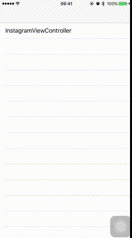

# PagingFlowView

[](https://travis-ci.org/xohozu/PagingFlowView)
[](http://cocoapods.org/pods/PagingFlowView)
[](http://cocoapods.org/pods/PagingFlowView)
[](http://cocoapods.org/pods/PagingFlowView)

## Demo



## Sample Code

```swift
override func viewDidLoad() {
    super.viewDidLoad()

    // begin to create cusmizable paging flow layout

    let pagingFlowLayout = PagingFlowLayout()

    pagingFlowLayout.pageRange = 145
    pagingFlowLayout.minimumSkippingPages = 1
    pagingFlowLayout.maximumSkippingPages = 1
    // pagingFlowLayout.pagingAlignOffset = CGPoint(x: -10, y: 0)
    // pagingFlowLayout.initiateCompensativeAnimationOnEndDraggingPage = true

    // that's done

    // below lines code is common configuration

    pagingFlowLayout.itemSize = CGSize(width: 140, height: 210)
    pagingFlowLayout.minimumLineSpacing = 5
    pagingFlowLayout.minimumInteritemSpacing = 5
    pagingFlowLayout.scrollDirection = .horizontal

    collectionView = UICollectionView(frame: CGRect(origin: .zero, size: CGSize(width: view.bounds.width, height: 210)), collectionViewLayout: pagingFlowLayout)

    collectionView.center = view.center
    collectionView.dataSource = self
    collectionView.delegate = self
    collectionView.contentInset = UIEdgeInsets(top: 0, left: 10, bottom: 0, right: 10)
    collectionView.register(InstagramUserRecommendationCell.self, forCellWithReuseIdentifier: "InstagramUserRecommendationCell")
    collectionView.backgroundColor = UIColor(red: 250.0 / 255, green: 250.0 / 255, blue: 250.0 / 255, alpha: 1.0)

    view.addSubview(collectionView)
    view.backgroundColor = .white

    automaticallyAdjustsScrollViewInsets = false
}
```

## Example

To run the example project, clone the repo, and run `pod install` from the Example directory first.

## Requirements

## Installation

PagingFlowView is available through [CocoaPods](http://cocoapods.org). To install
it, simply add the following line to your Podfile:

```ruby
pod "PagingFlowView"
```

## Author

xohozu, xohozu@gmail.com

## License

PagingFlowView is available under the MIT license. See the LICENSE file for more info.
